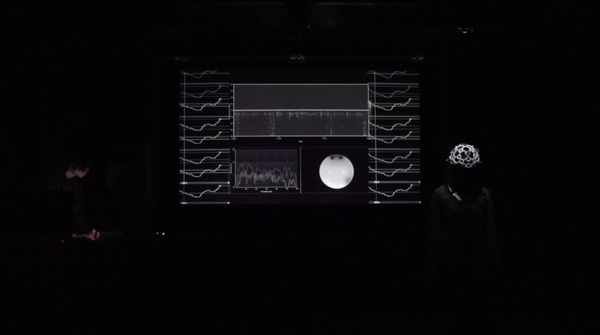
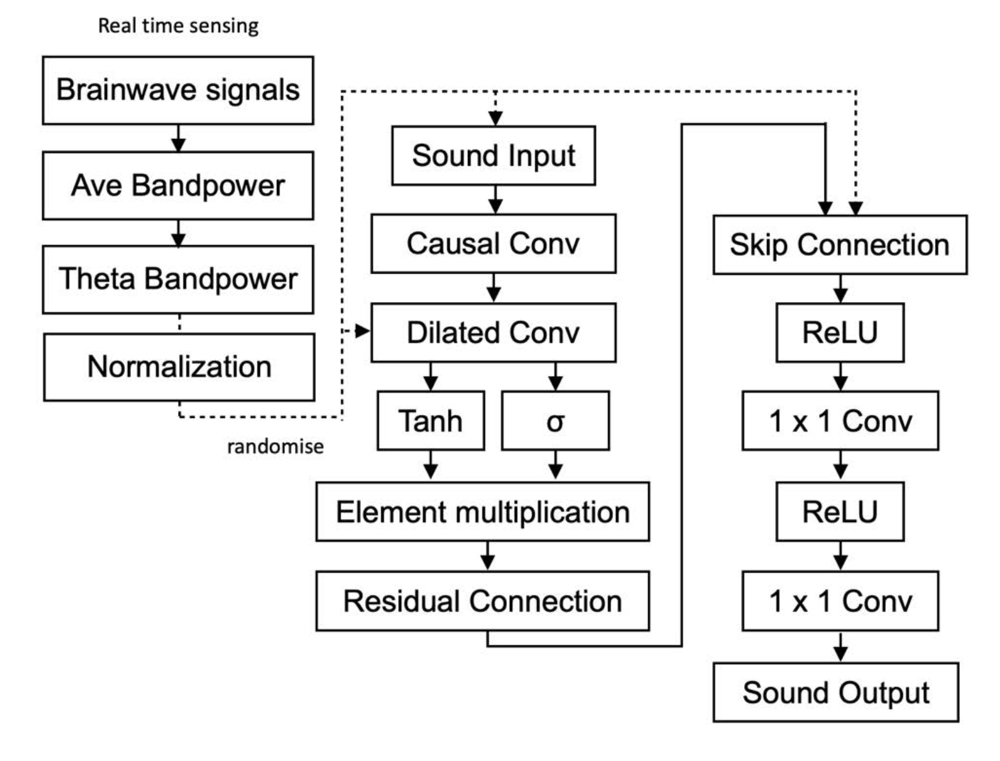

<p align="center">

</p>

# liberated-frequencies

<h4>
    <a href="https://keigoyoshida.jp/room20.html">Homepage</a> |
    <a href="https://www.instagram.com/p/DGqFPAOO3oo/">Archives</a> |
    <a href="https://flyingtokyo.com/open-call/">This project Support by METI and Rhizomatiks as "Flying Tokyo 2024"</a> |

</h4>

liberated frequencies, explores unprecedented soundscapes that defy our traditional auditory pleasures by "liberating" AI from the limitations of human-defined ‘pleasing'.<br>
The AI continuously learns in real-time from the highest-rated sounds. Utilizing this sound data, the AI predicts and generates the subsequent auditory experiences, creating an evolving and immersive soundscape.<br>
The subject in the soundscape wears EEG sensors that measure real-time theta waves (4-8 Hz) of her brain activity. <br>According to Sammler et al. (2007), increased activity in this frequency band is typically associated with intensified auditory pleasure.<br>
However, in response to this heightened brain-based pleasure, the AI—continuously learning from the real-time EEG data—intentionally disrupts the experience.<br>
It transforms the generated sounds, subtly altering pitches, waveforms, tempos and syncopations, gradually diverging from the original sound patterns the subject found pleasurable.<br>
This deliberate shift invites the viewer to explore the boundaries of discomfort, challenging the conventional auditory aesthetics inherently favored by human perception.<br>
Do these deliberately 'liberated' sounds merely traumatize the human senses, or do they open a gateway to new auditory expressions and possibilities?<br>




**Core features of liberated frequencies include:**

-   Deviation from Wavenet (https://arxiv.org/abs/1609.03499) based sound outouts.
-   Brainwave lawdata receive via OSC from [[Open BCI](https://github.com/OpenBCI/OpenBCI_GUI)].
-   Sound Input and Output with tarageting channels.

**Software Usage:**

-   OpenBCI GUI, Ableton, Logic Pro, BlackHole Virtual Audio 16ch, 64ch.

**Audio Input / Output Sample:**
-  [[Input](https://soundcloud.com/2ety8cvnb6hy/not-liberated_frequencies?si=808da9f9b07543609e2672d12e6a9529&utm_source=clipboard&utm_medium=text&utm_campaign=social_sharing)] 
- [[Output](https://soundcloud.com/2ety8cvnb6hy/liberated-frequencies?si=cde8297539904961b91409eaa9ee9de8&utm_source=clipboard&utm_medium=text&utm_campaign=social_sharing)] 


## Python quick start

Please follow the python code wich uploaded. Numer of audio channels are able to detect by audio_channel_detector.py<br>
For this time, Input Audio comes from Ableton 12 via BlackHole Virtual Audio 16ch to Output for Logic Pro via BlackHole Virtual Audio 64ch. Then, Audio Outs for Interface from Logic Pro.<br>
Brain EEG data are received via OSC from [[Open BCI GUI](https://github.com/OpenBCI/OpenBCI_GUI)] with [[8ch OpenBCI Headset](https://shop.openbci.com/products/the-complete-headset-eeg
)].

```bash
import pyaudio
import numpy as np
import torch
import torch.nn as nn
import threading
import queue
from pythonosc import dispatcher, osc_server

# ==================================================
# Main user-defined parameters (change here)
# ==================================================

# Index of input/output audio devices
DEVICE_INDEX = 2        # Input device index (e.g., 1)
OUTPUT_DEVICE_INDEX = 4 # Output device index (e.g., 3)

# Number of channels for input/output
INPUT_CHANNELS = 16      # Number of input channels
OUTPUT_CHANNELS = 64     # Number of output channels

# Select which input channel to use (0-based)
TARGET_CHANNEL_INDEX = 0  # e.g., 0 = use 1st channel

# Common audio I/O settings
RATE = 44100
CHUNK = 512
FORMAT = pyaudio.paFloat32

# Length of audio in seconds to pass to WaveNet at once
# (Shorter = faster inference, less dropout)
ACCUMULATION_DURATION = 8
ACCUMULATION_SAMPLES = RATE * ACCUMULATION_DURATION

# Number of samples used for crossfade
CROSSFADE_SAMPLES = 2028

# Example WaveNet model parameters
WAVENET_IN_CHANNELS     = 1
WAVENET_OUT_CHANNELS    = 256
WAVENET_RESIDUAL_CH     = 32
WAVENET_DILATION_CH     = 32
WAVENET_SKIP_CH         = 32
WAVENET_NUM_LAYERS      = 10

# OSC receiving port
OSC_IP = "192.168.10.4"
OSC_PORT = 10001

# Monitored OSC addresses: /openbci/time-series-raw/ch4 to ch7
# If their average increases, force an increase in randomization
OPENBCI_CHANNELS = ["ch4", "ch5", "ch6", "ch7"]
values_for_avg = []
MAX_STORE = 100
previous_mean = 0.0

# =========================================
# Blend mode flag: add vs. multiply
# =========================================
USE_MULTIPLICATIVE_BLEND = False

# =========================================
# Randomization rates updated via OSC (expected range: 0.0–1.0)
# Used by adding or multiplying with analysis results
# =========================================
waveform_randomization_rate = 0.0
tempo_randomization_rate    = 0.0

# =========================================
# WaveNet model definition
# =========================================
class WaveNet(nn.Module):
    def __init__(self, in_channels, out_channels, residual_channels, dilation_channels, skip_channels, num_layers):
        super(WaveNet, self).__init__()
        self.residual_layers = nn.ModuleList()
        self.dilated_convs = nn.ModuleList()
        self.skip_convs = nn.ModuleList()

        for i in range(num_layers):
            dilation = 2 ** i
            # First layer uses in_channels, others use residual_channels
            self.dilated_convs.append(
                nn.Conv1d(
                    in_channels if i == 0 else residual_channels,
                    dilation_channels,
                    kernel_size=2,
                    dilation=dilation,
                    padding=dilation
                )
            )
            self.skip_convs.append(
                nn.Conv1d(dilation_channels, skip_channels, kernel_size=1)
            )
            self.residual_layers.append(
                nn.Conv1d(dilation_channels, residual_channels, kernel_size=1)
            )
    
    def forward(self, x):
        """
        x shape: (batch_size, in_channels, time)
        return shape: (batch_size, skip_channels, time)
        """
        skip_connections = []
        for dilated_conv, skip_conv, residual_layer in zip(
            self.dilated_convs, self.skip_convs, self.residual_layers
        ):
            out = dilated_conv(x)
            skip_out = skip_conv(out)

            if skip_connections and skip_out.size(2) != skip_connections[0].size(2):
                skip_out = skip_out[:, :, :skip_connections[0].size(2)]
            skip_connections.append(skip_out)
            
            residual_out = residual_layer(out)
            if residual_out.size(2) > x.size(2):
                residual_out = residual_out[:, :, :x.size(2)]
            elif residual_out.size(2) < x.size(2):
                x = x[:, :, :residual_out.size(2)]
            
            x = x + residual_out
        
        return torch.sum(torch.stack(skip_connections), dim=0)

# =========================================
# Setup PyAudio streams
# =========================================
audio = pyaudio.PyAudio()

# Input stream
input_stream = audio.open(
    format=FORMAT,
    channels=INPUT_CHANNELS,
    rate=RATE,
    input=True,
    frames_per_buffer=CHUNK,
    input_device_index=DEVICE_INDEX
)

# Output stream
output_stream = audio.open(
    format=FORMAT,
    channels=OUTPUT_CHANNELS,
    rate=RATE,
    output=True,
    frames_per_buffer=CHUNK,
    output_device_index=OUTPUT_DEVICE_INDEX
)

def get_audio_chunk():
    """Extract only the TARGET_CHANNEL_INDEX from INPUT_CHANNELS"""
    data = input_stream.read(CHUNK, exception_on_overflow=False)
    data_np = np.frombuffer(data, dtype=np.float32).reshape(-1, INPUT_CHANNELS)
    return data_np[:, TARGET_CHANNEL_INDEX]

# =========================================
# Instantiate WaveNet model
# =========================================
model = WaveNet(
    in_channels=WAVENET_IN_CHANNELS,
    out_channels=WAVENET_OUT_CHANNELS,
    residual_channels=WAVENET_RESIDUAL_CH,
    dilation_channels=WAVENET_DILATION_CH,
    skip_channels=WAVENET_SKIP_CH,
    num_layers=WAVENET_NUM_LAYERS
)
model.eval()

# =========================================
# Audio analysis functions
# (results used to control next randomization rate)
# =========================================
def measure_waveform_rms(audio_data: np.ndarray) -> float:
    if len(audio_data) == 0:
        return 0.0
    return float(np.sqrt(np.mean(audio_data**2)))

def measure_tempo_naive(audio_data: np.ndarray, sr: int) -> float:
    block_size = 1024
    energies = []
    for i in range(0, len(audio_data), block_size):
        block = audio_data[i:i+block_size]
        energies.append(np.sum(block**2))
    energies = np.array(energies)
    if len(energies) < 2:
        return 0.0
    threshold = np.mean(energies)*2.0
    peak_indices = np.argwhere(energies > threshold).flatten()
    if len(peak_indices) < 2:
        return 0.0
    intervals = np.diff(peak_indices)
    avg_interval = np.mean(intervals)
    avg_samples = avg_interval * block_size
    if avg_samples <= 0:
        return 0.0
    bpm = 60.0 / (avg_samples / sr)
    return float(bpm)

# =========================================
# Randomization functions (simple implementation)
# =========================================
def randomize_waveform(audio_data, rate):
    if rate <= 0.0:
        return audio_data
    noise = np.random.uniform(-1, 1, len(audio_data)) * rate
    return audio_data + noise

def random_tempo(audio_data, rate):
    if rate <= 0.0:
        return audio_data
    factor = np.random.uniform(1 - rate, 1 + rate)
    indices = np.arange(0, len(audio_data), factor)
    return np.interp(indices, np.arange(len(audio_data)), audio_data)

# =========================================
# Crossfade function
# =========================================
def crossfade(old_audio: np.ndarray, new_audio: np.ndarray, fade_len: int) -> np.ndarray:
    if len(old_audio) == 0:
        return new_audio
    if len(new_audio) == 0:
        return old_audio
    
    cross_len = min(len(old_audio), len(new_audio), fade_len)
    old_non_overlap = old_audio[:-cross_len] if len(old_audio) > cross_len else np.array([], dtype=np.float32)
    new_non_overlap = new_audio[cross_len:]  if len(new_audio) > cross_len else np.array([], dtype=np.float32)

    fade_out = old_audio[-cross_len:]
    fade_in  = new_audio[:cross_len]

    crossfaded_region = []
    for i in range(cross_len):
        alpha = i / float(cross_len)
        val = (1.0 - alpha)*fade_out[i] + alpha*fade_in[i]
        crossfaded_region.append(val)
    crossfaded_region = np.array(crossfaded_region, dtype=np.float32)
    return np.concatenate([old_non_overlap, crossfaded_region, new_non_overlap])

# =========================================
# Output queue (stores generated audio for continuous playback)
# =========================================
output_queue = queue.Queue()

# =========================================
# (1) Main loop: input → WaveNet → output
#     Analyze last output (waveform, tempo, etc.)
#     Combine with OSC data to determine randomization → modify input
# =========================================
def process_input_and_generate():
    global waveform_randomization_rate
    global tempo_randomization_rate

    accumulated_audio = np.array([], dtype=np.float32)
    previous_output = np.array([], dtype=np.float32)

    # Previous analysis results
    measured_waveform = 0.0
    measured_tempo = 0.0

    while True:
        # Accumulate input chunks
        chunk = get_audio_chunk()
        accumulated_audio = np.concatenate((accumulated_audio, chunk))

        # Once enough (e.g., 2 sec), process with WaveNet
        if len(accumulated_audio) >= ACCUMULATION_SAMPLES:
            # 1) Analyze previous output
            if len(previous_output) > 0:
                measured_waveform = measure_waveform_rms(previous_output)
                measured_tempo = measure_tempo_naive(previous_output, RATE)

            # 2) Scale analysis results to 0.0–1.0
            wf_r = np.clip(measured_waveform, 0.0, 1.0)
            te_r = np.clip(measured_tempo / 300.0, 0.0, 1.0)  # 300 BPM = 1.0

            # 3) Blend analysis results with OSC randomization rate
            if USE_MULTIPLICATIVE_BLEND:
                wave_rate = wf_r * waveform_randomization_rate
                tempo_rate = te_r * tempo_randomization_rate
            else:
                wave_rate = wf_r + waveform_randomization_rate
                tempo_rate = te_r + tempo_randomization_rate
            
            wave_rate = np.clip(wave_rate, 0.0, 1.0)
            tempo_rate = np.clip(tempo_rate, 0.0, 1.0)

            # 4) Modify input audio → pass to WaveNet
            seg = accumulated_audio[:ACCUMULATION_SAMPLES]
            seg = randomize_waveform(seg, wave_rate)
            seg = random_tempo(seg, tempo_rate)

            input_tensor = torch.from_numpy(seg).unsqueeze(0).unsqueeze(0).float()
            output_tensor = model(input_tensor)  # (1, skip_ch, T)
            output_tensor = output_tensor.mean(dim=1, keepdim=True)  # Convert to mono
            new_output = output_tensor.squeeze().detach().numpy()

            # 5) Crossfade with previous output
            crossfaded_output = crossfade(previous_output, new_output, CROSSFADE_SAMPLES)
            previous_output = crossfaded_output

            # 6) Create output buffer (write only to TARGET_CHANNEL_INDEX)
            frames_out = np.zeros((len(crossfaded_output), OUTPUT_CHANNELS), dtype=np.float32)
            frames_out[:, TARGET_CHANNEL_INDEX] = crossfaded_output

            # 7) Push to output queue
            output_queue.put(frames_out)

            # 8) Remove used portion from accumulation
            accumulated_audio = accumulated_audio[ACCUMULATION_SAMPLES:]

# =========================================
# (2) Output loop - continuously play from output_queue
# =========================================
def audio_output_loop():
    while True:
        frames = output_queue.get()
        if frames is None:
            break
        output_stream.write(frames.tobytes())

# =========================================
# (3) OSC Receiver
#     Monitor only the addresses /openbci/time-series-raw/ch4 to ch7,
#     and if the average increases compared to the previous value, force waveform randomization.
#     Additionally, if /waveform, /pitch, /tempo, /syncopation are received,
#     update the randomization rate accordingly.
# =========================================
def osc_handler(address, *args):
    global waveform_randomization_rate
    global tempo_randomization_rate
    global values_for_avg
    global previous_mean

    # Handle OpenBCI channels
    if any(ch in address for ch in OPENBCI_CHANNELS):
        try:
            value = float(args[0])
        except:
            return
        values_for_avg.append(value)
        if len(values_for_avg) > MAX_STORE:
            values_for_avg = values_for_avg[-MAX_STORE:]
        current_mean = np.mean(values_for_avg)
        if current_mean > previous_mean:
            waveform_randomization_rate = min(1.0, waveform_randomization_rate + 0.1)
            tempo_randomization_rate = min(1.0, tempo_randomization_rate + 0.1)
        previous_mean = current_mean

    # Handle specific parameters
    if "/waveform" in address:
        waveform_randomization_rate = np.clip(float(args[0]), 0.0, 1.0)
    elif "/tempo" in address:
        tempo_randomization_rate = np.clip(float(args[0]), 0.0, 1.0)

# =========================================
# Start OSC server in a separate thread
# =========================================
def start_osc_server():
    disp = dispatcher.Dispatcher()
    for ch in OPENBCI_CHANNELS:
        disp.map(f"/openbci/time-series-raw/{ch}", osc_handler)
    disp.map("/waveform", osc_handler)
    disp.map("/tempo", osc_handler)

    server = osc_server.ThreadingOSCUDPServer((OSC_IP, OSC_PORT), disp)
    print(f"Listening on {OSC_IP}:{OSC_PORT}...")
    server.serve_forever()

# =========================================
# Main execution
# =========================================
if __name__ == "__main__":
    threading.Thread(target=start_osc_server, daemon=True).start()
    threading.Thread(target=process_input_and_generate, daemon=True).start()
    audio_output_loop()

```

## Communication channels

-   [Instagram DM](https://www.instagram.com/keigoyoshida_/): bug reports,
    feature requests,discussions etc.

## Citation

Please cite our work if you use liberated frequencies.

```bib
    author    = {Keigo Yoshida and Rinko Oka and Ryuji Kurokawa (Arsaffix)},
    title     = {liberated frequencies},
    journal   = {none},
    year      = {2024},
```
